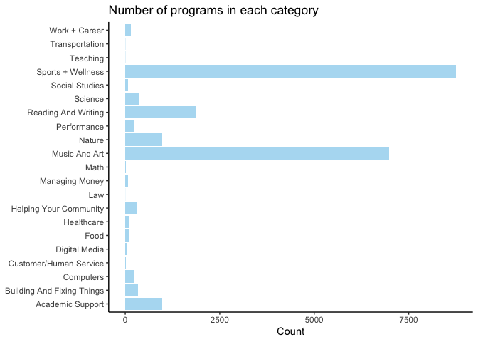
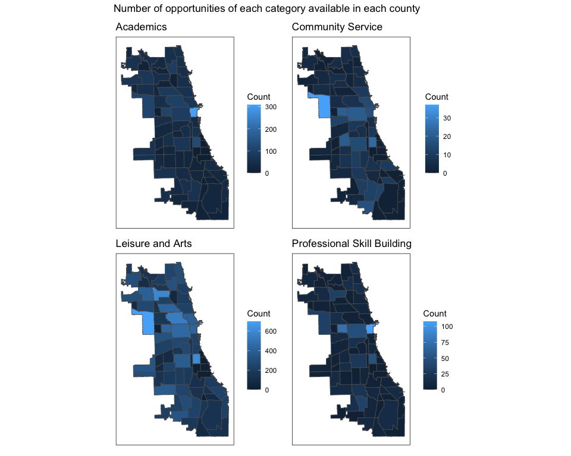
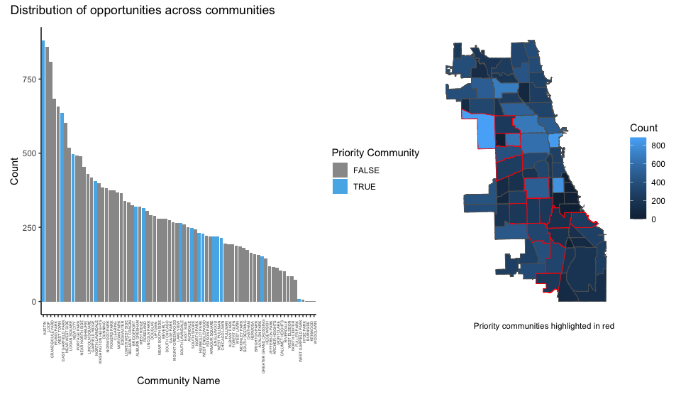
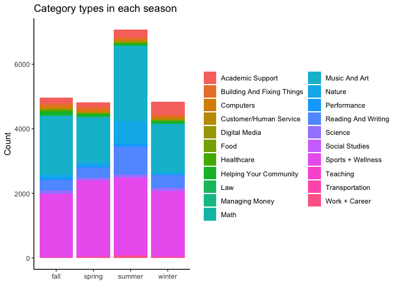
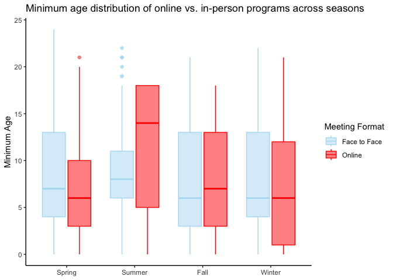
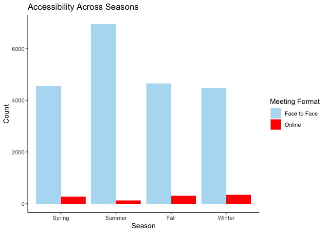

My CHI. My Future. Exploratory Data Analysis
================
Shruti Rathnavel, Emma Yu, and Rhona Zhang
05-05-2023

# My CHI. My Future.

My CHI. My Future. is a youth initiative for the City of Chicago
launched in May 2020 to connect young people, ranging from the ages
0-24, with out-of-school programs.

The aim is to create a city-wide and community network for nearly 350
organizations and youth to easily discover and cultivate their passions
and talents, as well as strengthen and center their identity and voice.

## Project Goals

Our goal is to visualize the equity of opportunity for the City of
Chicago’s youth to have access to and participate in local out-of-school
programs across the city’s diverse neighborhoods and communities.

We would like to understand how accessible are different categories of
programs for different ages of youth. From the data we have, we want to
understand how equitable the youth opportunity landscape is across
geography by age and category. Do youth in different communities/regions
have the same access to similar types of programs? It may vary depending
on age and category.

Since online programs technically serve all geographic regions of
Chicago, we will separately analyze online programs and compare the
results with those from in-person programs. However, we do acknowledge
that the engagement and experiences vary between the different program
types.

## Description of Data

My CHI. My Future. has over 350 providers, including the Park District
and Public Library, that each offer thousands of community programs.
Therefore, the database is quite vast, consisting of 56 variables and
over 80,000 observations. However, after removing duplicates and
unusable observations, 21,689 observations remained.

Providers are required to specify information about their opportunities,
which include the program name, description, organization name, minimum
age, maximum age, meeting type, start and end date, and program price.
Other variables also include category, capacity, URL, free food
available, etc.

The data organizes these opportunities into 4 types:

- Programs: lasting five days to a year or recurring
- Events: four days or less
- Jobs: work and career, paid opportunity
- Resources: longer than 1 year

``` r
time %>%
  group_by(program_type) %>%
  summarize(Count = n()) %>%
  mutate(program_type = str_to_title(program_type)) %>%
  rename(`Program Type` = program_type) %>%
  formattable(align = c("l", "c"))
```

<table class="table table-condensed">
<thead>
<tr>
<th style="text-align:left;">
Program Type
</th>
<th style="text-align:center;">
Count
</th>
</tr>
</thead>
<tbody>
<tr>
<td style="text-align:left;">
Events
</td>
<td style="text-align:center;">
7585
</td>
</tr>
<tr>
<td style="text-align:left;">
Job
</td>
<td style="text-align:center;">
157
</td>
</tr>
<tr>
<td style="text-align:left;">
Programs
</td>
<td style="text-align:center;">
13841
</td>
</tr>
<tr>
<td style="text-align:left;">
Resources
</td>
<td style="text-align:center;">
106
</td>
</tr>
</tbody>
</table>

## Data Wrangling

The data required extensive cleaning and wrangling. There were many
unhelpful variables and variables with extreme missingness issues that
were removed. We also dropped observations with minimum age \> 24 (not
for our target audience), face to face observations without address and
coordinate data (unable to map), and non-Chicago observations. We also
created new variables including a general category variable, minimum and
maximum grade variables using minimum and maximum age, and priority
community factor variable. We used geospatial data from the City of
Chicago’s data portal to impute missing community values and allow
mapping. Finally, we had to get rid of duplicate observations. Click the
button on the right to see the code.

``` r
# load data----
data <- read_tsv("data/convert_MCMF_ALL_TIME_DATA.csv",
                 show_col_types = FALSE) 
chicago_sf <- read_sf("data/CommAreas.geojson")

# clean data----
## clean names, get rid of unneeded columns and columns w/ missingness issue
data <- data %>%
  clean_names() %>%
  select(-c("registration_open", "registration_deadline",
            "logo_url", "online_address", "program_url", 
            "registration_url","contact_name", "contact_email", 
            "contact_phone", "fri_end_time", "fri_start_time",
            "mon_end_time", "mon_start_time", "sat_end_time", 
            "sat_start_time", "sun_end_time", "sun_start_time",
            "thurs_end_time", "thurs_start_time", "tues_end_time", 
            "tues_start_time", "wed_end_time", "wed_start_time", 
            "scheduled_mon", "scheduled_tues", "scheduled_fri",
            "scheduled_sat", "scheduled_sun", "scheduled_thurs",
            "scheduled_wed")) 

## clean category_name values
data <- data %>%
  mutate(category_name = str_replace(category_name, '&', 'And'),
         category_name = str_replace_all(category_name, '\\.', '')) 

## get rid of observations with min_age < 25 and NA category
data <- data %>% 
  filter(min_age < 25, !is.na(category_name)) 

## get rid of non-Chicago observations
data <- data %>%
  filter(city == "Chicago" | is.na(city))

## fix max_age: anything >= 24 is set to 24
data <- data %>%
  mutate(max_age = case_when(max_age > 24 ~ 24,
                             max_age <= 24 ~ max_age))

## create min_grade and max_grade variables
data <- data %>%
  mutate(min_grade = case_when(
    min_age <= 5 ~ 0, min_age == 6 ~ 1, min_age == 7 ~ 2, min_age == 8 ~ 3,
    min_age == 9 ~ 4, min_age == 10 ~ 5, min_age == 11 ~ 6, min_age == 12 ~ 7,
    min_age == 13 ~ 8, min_age == 14 ~ 9, min_age == 15 ~ 10, min_age == 16 ~ 11,
    min_age == 17 ~ 12, min_age >= 18 ~ 13),
    max_grade = case_when(
      max_age <= 5 ~ 0, max_age == 6 ~ 1, max_age == 7 ~ 2, max_age == 8 ~ 3,
      max_age == 9 ~ 4, max_age == 10 ~ 5, max_age == 11 ~ 6, max_age == 12 ~ 7,
      max_age == 13 ~ 8, max_age == 14 ~ 9, max_age == 15 ~ 10, max_age == 16 ~ 11,
      max_age == 17 ~ 12, max_age >= 18 ~ 13)) 

## impute missing geographic_cluster_name for face to face rows
### get rid of face to face observations that don't have addresses and lon/lat data
data <- data %>%
  filter(!(is.na(address) & 
             is.na(latitude) & 
             meeting_type == "face_to_face" &
             is.na(geographic_cluster_name))) %>%
  filter(!(meeting_type == "face_to_face" & 
             is.na(geographic_cluster_name) &
             !is.na(address) &
             is.na(zipcode)))
### impute lon/lat data with address using geocode
imputed_coord <- data %>%
  filter(meeting_type == "face_to_face" & is.na(geographic_cluster_name)) %>%
  filter(!is.na(address)) %>%
  select(-c("latitude", "longitude")) %>%
  unite(complete_address, c(address, city, state, zipcode), sep = ", ") %>%
  mutate(complete_address = case_when(
    complete_address == "4753 N Broadway 4th floor, Chicago, IL, 60640" ~ 
      "4753 N Broadway, Chicago, IL, 60640",
    complete_address == "2026 S. Blue Island, Chicago, IL, 60608" ~ 
      "2026 S. Blue Island Avenue, Chicago, IL, 60608",
    complete_address == "1200 West Harrison St., Suite #2560, Chicago, IL, 60607" 
    ~ "1200 West Harrison St., Chicago, IL, 60607",
    complete_address == "1501 W. 67th Street, Chicago, Illinois, 60621" ~ 
      "1501 West 67th, Chicago, IL 60636",
    complete_address == "7015 N Raveswood, Chicago, Illinois, 60626" ~ 
      "7015 N Ravenswood, Chicago, Illinois, 60626",
    complete_address == "5085 W. Adams, Chicago, IL, 60644" ~ 
      "5085 W. Adams Street, Chicago, IL, 60644",
    complete_address == "8050 S. Chapel, Chicago, IL, 60649" ~ 
      "8050 S Chappel Ave, Chicago, IL 60617",
    complete_address == "1130 Midway Plaisance North, Chicago, IL, 60637" ~ 
      "1130 Midway Plaisance, Chicago, IL 60637",
    complete_address == "East 87th at Lake Michigan, Chicago, IL, 60619" ~ 
      "8555 S Green Bay Ave, Chicago, IL 60617",
    complete_address == "5458 W. Kinzie Pkwy., Chicago, IL, 60644" ~ 
      "5458 W. Kinzie St, Chicago, IL, 60644",
    complete_address == "100 Central Park Ave, Chicago, IL, 60624" ~ 
      "100 N Central Park Ave, Chicago, IL, 60624",
    complete_address == "5445 N. Chester St., Chicago, IL, 60656" ~ 
      "5445 N. Chester Ave., Chicago, IL, 60656",
    complete_address == "6100 S. Green, Chicago, IL, 60621" ~ 
      "6100 S. Green St, Chicago, IL, 60621",
    complete_address == "5085 W. Adams, Chicago, Illinois, 60644" ~ 
      "5085 W. Adams St, Chicago, Illinois, 60644",
    complete_address == "1309 S Wood, Chicago, IL, 60608" ~ 
      "1309 S Wood St, Chicago, IL, 60608",
    complete_address == "1145 W. Wilson, Chicago, IL, 60640" ~ 
      "1145 W. Wilson Ave, Chicago, IL, 60640",
    complete_address == "3858 S. Cottage Grove, Chicago, IL, 60653" ~ 
      "3858 S. Cottage Grove Ave, Chicago, IL, 60653",
    complete_address == "within Harrison Park Fieldhouse, Chicago, IL, 60608" ~ 
      "1824 S. Wood St. Chicago, IL 60608",
    complete_address == "within Calumet Park Fieldhouse, Chicago, IL, 60617" ~ 
      "9801 S. Avenue G, Chicago, IL, 60617",
    complete_address == "within Avondale Park Fieldhouse, Chicago, IL, 60618" ~ 
      "3516 W. School St. Chicago, IL 60618",
    complete_address == "within Broadway Armory Park Fieldhouse, Chicago, IL, 60660" ~ 
      "5917 N. Broadway Chicago, IL 60660",
    complete_address == "within Jesse White Community Center, Chicago, IL, 60654" ~ 
      "410 W Chicago Ave, Chicago, IL, 60654",
    complete_address == "within McKinley Park Fieldhouse, Chicago, IL, 60609" ~ 
      "2210 W. Pershing Rd., Chicago, IL, 60609",
    complete_address == "8029 W. Forest Preserve Ave., Chicago, IL, 60634" ~ 
      "8021 W Addison St, Chicago, IL 60634",
    complete_address == "within Garfield Park Fieldhouse, Chicago, IL, 60624" ~ 
      "100 N. Central Park Ave. Chicago, IL 60624",
    complete_address == "1147 N. Western, Chicago, IL, 60622" ~ 
      "1147 N. Western Ave, Chicago, IL, 60622",
    .default = complete_address
  )) %>%
  geocode(complete_address, method = 'osm', lat = latitude , long = longitude)
### join imputed_coord to data
data <- merge(x = data, 
              y = imputed_coord[ , c("index_row", "latitude", "longitude")], 
              by = "index_row", all.x = TRUE) %>%
  mutate(latitude = coalesce(latitude.x, latitude.y),
         longitude = coalesce(longitude.x, longitude.y)) %>%
  select(-c(latitude.x, latitude.y, longitude.x, longitude.y))
### use geocode data to match geographic cluster 
sf_coords <- data %>% 
  filter(meeting_type == "face_to_face" & is.na(geographic_cluster_name)) %>%
  st_as_sf(coords = c("longitude", "latitude"), crs = "WGS84")
sf <- st_join(chicago_sf, sf_coords, left = FALSE) 
### merge geocode data 
data <- merge(x = data,
              y = sf[ , c("index_row", "community", "area", "shape_area",
                          "perimeter", "area_num_1", "area_numbe", "comarea_id",
                          "comarea", "shape_len", "geometry")],
              by = "index_row", all.x = TRUE) %>%
  mutate(community_name = coalesce(geographic_cluster_name, community)) %>%
  select(-c(geographic_cluster_name, community)) 

data <- data %>%
  mutate(community_name = case_when(
    community_name == "Little Village" ~ "SOUTH LAWNDALE",
    community_name == "GARFIELD PARK" ~ "EAST GARFIELD PARK",
    community_name == "Bronzeville/South Lakefront" ~ "GRAND BOULEVARD",
    community_name == "Back of the Yards" ~ "NEW CITY",
    .default = community_name
  )) %>%
  merge(
    y = chicago_sf,
    by.x = "community_name", 
    by.y = "community", all.x = TRUE) %>%
  mutate(area = coalesce(area.x, area.y),
         shape_area = coalesce(shape_area.x, shape_area.y),
         perimeter = coalesce(perimeter.x, perimeter.y),
         area_num_1 = coalesce(area_num_1.x, area_num_1.y),
         area_numbe = coalesce(area_numbe.x, area_numbe.y),
         comarea_id = coalesce(comarea_id.x, comarea_id.y),
         comarea = coalesce(comarea.x, comarea.y),
         shape_len = coalesce(shape_len.x, shape_len.y),
         geometry = geometry.y) %>%
  select(-c(area.x, area.y, shape_area.x, shape_area.y, area_num_1.x, 
            area_num_1.y, area_numbe.x, area_numbe.y, comarea_id.x, 
            comarea_id.y, comarea.x, comarea.y, shape_len.x, shape_len.y,
            geometry.x)) %>%
  filter(!is.na(community_name))

## create priority region factor variable 
list_priority_areas = c("Austin", "North Lawndale", "Humboldt Park", 
                        "East Garfield Park", "Englewood", "Auburn Gresham",
                        "West Garfield Park", "Roseland", "Greater Grand Crossing",
                        "West Englewood", "South Shore", "New City", "Chicago Lawn",
                        "South Lawndale", "West Pullman"
)
data <- data %>%
  mutate(priority = tolower(community_name) %in% 
           tolower(list_priority_areas)) 

## remove ohare community observations
data <- data %>%
  filter(community_name != "OHARE")

## combine categories to 4 general categories
data <- data %>%
  mutate(general_category = case_when(
    category_name %in% c("Music And Art", "Performance", "Sports + Wellness", "Nature", "Food") ~ "Leisure and Arts",
    category_name %in% c("Academic Support", "Math", "Reading And Writing", "Science", "Science And Math","Social Studies", "Teaching") ~ "Academics",
    category_name %in% c("Building And Fixing Things", "Computers", "Digital Media", "Managing Money", "Law", "Work + Career") ~ "Professional Skill Building",
    category_name %in% c("Helping Your Community", "Transportation", "Customer/Human Service", "Healthcare") ~ "Community Service"))

## get rid of duplicate observations
data <- data %>% 
  distinct(id, category_name, .keep_all = TRUE) %>%
  distinct(program_name, category_name, .keep_all = TRUE)

## data w/ column for length of opportunity
time <- data %>%
  mutate(start_date = as.Date(start_date, format = "%m/%d/%y"),
         end_date = parse_date_time(end_date, orders = c("%m/%d/%y")),
         program_length = as.numeric(difftime(end_date, start_date, units = "days") + 1)) %>% 
  # new column: program type
  mutate(program_type = case_when(
    program_pays_participants == "Paid, Type Unknown" ~ "job",
    program_length <= 4 ~ "events",
    program_length >= 5 & program_length <= 365 ~ "programs",
    program_length > 365 ~ "resources")) 

## data w/ column for season of each event based on month of start_date
seasons <- data %>%
  mutate(new_start_date = parse_date_time(start_date, orders = c("%m/%d/%y")),
         program_season = case_when(
           month(new_start_date) %in% c(3,4,5) ~ 'spring',
           month(new_start_date) %in% c(6,7,8) ~ 'summer',
           month(new_start_date) %in% c(9,10,11) ~ 'fall',
           month(new_start_date) %in% c(12,1,2) ~ 'winter',
         )) %>% 
  select(-new_start_date)

## opportunity count data
data2 <- data %>%
  select(community_name, general_category) %>%
  st_drop_geometry() %>%
  add_row(community_name = "OAKLAND", general_category = "Academics") %>%
  add_row(community_name = "OAKLAND", general_category = "Leisure and Arts") %>%
  add_row(community_name = "OAKLAND", general_category = "Community Service") %>%
  add_row(community_name = "OAKLAND", general_category = "Professional Skill Building") %>%
  add_row(community_name = "WASHINGTON PARK", general_category = "Academics") %>%
  add_row(community_name = "WASHINGTON PARK", general_category = "Leisure and Arts") %>%
  add_row(community_name = "WASHINGTON PARK", general_category = "Community Service") %>%
  add_row(community_name = "WASHINGTON PARK", general_category = "Professional Skill Building") %>%
  add_row(community_name = "AVALON PARK", general_category = "Community Service") %>%
  add_row(community_name = "BURNSIDE", general_category = "Academics") %>%
  add_row(community_name = "BURNSIDE", general_category = "Community Service") %>%
  add_row(community_name = "BURNSIDE", general_category = "Professional Skill Building") %>%
  add_row(community_name = "EAST SIDE", general_category = "Community Service") %>%
  add_row(community_name = "FULLER PARK", general_category = "Community Service") %>%
  add_row(community_name = "FULLER PARK", general_category = "Professional Skill Building") %>%
  add_row(community_name = "HERMOSA", general_category = "Professional Skill Building") %>%
  add_row(community_name = "HYDE PARK", general_category = "Academics") %>%
  add_row(community_name = "HYDE PARK", general_category = "Community Service") %>%
  add_row(community_name = "HYDE PARK", general_category = "Professional Skill Building") %>%
  add_row(community_name = "JEFFERSON PARK", general_category = "Community Service") %>%
  add_row(community_name = "KENWOOD", general_category = "Academics") %>%
  add_row(community_name = "KENWOOD", general_category = "Community Service") %>%
  add_row(community_name = "KENWOOD", general_category = "Professional Skill Building") %>%
  add_row(community_name = "MONTCLARE", general_category = "Community Service") %>%
  add_row(community_name = "SOUTH DEERING", general_category = "Community Service") %>%
  add_row(community_name = "WEST ELSDON", general_category = "Professional Skill Building") %>%
  add_row(community_name = "WEST ELSDON", general_category = "Community Service") %>%
  add_row(community_name = "WEST GARFIELD PARK", general_category = "Academics") %>%
  add_row(community_name = "WEST GARFIELD PARK", general_category = "Community Service") %>%
  add_row(community_name = "WEST GARFIELD PARK", general_category = "Professional Skill Building") %>%
  add_row(community_name = "WOODLAWN", general_category = "Community Service") %>%
  add_row(community_name = "WOODLAWN", general_category = "Professional Skill Building") %>%
  add_row(community_name = "WOODLAWN", general_category = "Leisure and Arts") 
  
gencat_count <- data2 %>%
  group_by(community_name, general_category) %>%
  summarise(n = n()) %>%
  complete() %>%
  filter(!is.na(general_category)) %>%
  mutate(n = case_when(
    community_name %in% c("OAKLAND", "WASHINGTON PARK") ~ 0,
    .default = n
  ))
gencat_count <- merge(gencat_count,
                      y = chicago_sf,
                      by.x = "community_name", 
                      by.y = "community", all.x = TRUE) %>% 
  select(c(community_name, general_category, n, geometry)) %>%
  mutate(priority = tolower(community_name) %in% 
           tolower(list_priority_areas))
```

## Visualizations

### Accessibility Across Different Categories

``` r
ggplot(data = data, mapping = aes(x = category_name)) +
  geom_bar(fill = "#B3DDF2") + 
  coord_flip() +
  labs(title = "Number of programs in each category", 
       x = NULL,
       y = "Count") +
  theme_classic()
```

<!-- -->

``` r
a <- ggplot(data = st_as_sf(gencat_count) %>% 
              filter(general_category == "Academics"), 
       aes(fill = n)) +
  geom_sf() +
  labs(title = "Academics",
       fill = "Count") +
  theme_minimal() +
  theme(axis.ticks = element_blank(),
        axis.text = element_blank(),
        panel.border = element_rect(fill=NA),
        panel.grid = element_blank())

b <- ggplot(data = st_as_sf(gencat_count) %>% 
              filter(general_category == "Community Service"),
       aes(fill = n)) +
  geom_sf() +
  labs(title = "Community Service",
       fill = "Count") +
  theme_minimal() +
  theme(axis.ticks = element_blank(),
        axis.text = element_blank(),
        panel.border = element_rect(fill=NA),
        panel.grid = element_blank())

c <- ggplot(data = st_as_sf(gencat_count) %>% 
              filter(general_category == "Leisure and Arts"),
       aes(fill = n)) +
  geom_sf() +
  labs(title = "Leisure and Arts",
       fill = "Count") +
  theme_minimal() +
  theme(axis.ticks = element_blank(),
        axis.text = element_blank(),
        panel.border = element_rect(fill=NA),
        panel.grid = element_blank())

d <- ggplot(data = st_as_sf(gencat_count) %>% 
              filter(general_category == "Professional Skill Building"),
       aes(fill = n)) +
  geom_sf() +
  labs(title = "Professional Skill Building",
       fill = "Count") +
  theme_minimal() +
  theme(axis.ticks = element_blank(),
        axis.text = element_blank(),
        panel.border = element_rect(fill=NA),
        panel.grid = element_blank())

# combine plots
a + b + c + d + plot_annotation(
  title = "Number of opportunities of each category available in each county")
```

<!-- -->

``` r
e <- ggplot(data %>% filter(!is.na(community_name)), 
       mapping = aes(fct_infreq(community_name), fill = priority)) +
  geom_bar() + 
  labs(x = "Community Name",
       y = "Count",
       fill = "Priority Community") +
  theme_classic() +
  theme(axis.text.x = element_text(size = 4, 
                                   angle = 90, 
                                   hjust = 0.95)) + 
  scale_fill_manual(values=c("#999999", "#56B4E9"))

f_dat <- st_as_sf(gencat_count %>%
  group_by(community_name, geometry, priority) %>%
  summarise(n = sum(n))) %>%
  arrange(priority)

f <- ggplot(data = f_dat) +
  geom_sf(aes(fill = n),
          color = ifelse(f_dat$priority == TRUE,
                         "red", "#5F6061"),
          lwd = 0.3) +
  labs("Count",
       caption = "Priority communities highlighted in red") +
  scale_fill_gradient(name = "Count") +
  theme_minimal() +
  theme(axis.ticks = element_blank(),
        axis.text = element_blank(),
        panel.grid = element_blank(),
        plot.caption = element_text(vjust = 40))

e + f + plot_annotation(
  title = "Distribution of opportunities across communities")
```

<!-- -->

### Time Series

``` r
ggplot(data = seasons, 
       mapping = aes(x = program_season, fill = category_name)) + 
  geom_bar() +
  labs(title = "Category types in each season", 
       x = NULL,
       y = "Count") +
  theme_classic() +
  theme(legend.title= element_blank())
```

<!-- -->

``` r
ggplot(data = seasons, 
       mapping = aes(x = program_season,  
                     y = min_age, 
                     color = meeting_type, 
                     fill = meeting_type)) +
  geom_boxplot(alpha = 0.5) +
  scale_color_manual(name = "Meeting Format", 
                     values = c("#B3DDF2", "#FF0000"),
                     labels = c("Face to Face", "Online")) +
  scale_fill_manual(name = "Meeting Format", 
                    values = c("#B3DDF2", "#FF0000"),
                    labels = c("Face to Face", "Online")) +
  scale_x_discrete(limits = c("spring", "summer", "fall", "winter"),
                   labels = c("Spring", "Summer", "Fall", "Winter")) +
  theme_classic() +
  labs(title = "Minimum age distribution of online vs. in-person programs across seasons", 
       x = NULL,
       y = "Minimum Age")
```

<!-- -->

### Online

``` r
ggplot(data = data, mapping = aes(x = program_price, fill = meeting_type)) +
  geom_bar(position = position_dodge()) + 
  scale_fill_manual(name = "Meeting Format", values = c("#B3DDF2", "#FF0000"),
                    labels = c("Face to Face", "Online")) +
  scale_x_discrete(limits = c("Free", "$50 or Less", "More Than $50", "Unknown")) +
  theme_classic() +
  labs(title = "Cost of attending online vs. in-person programs", 
       x = "Program Cost",
       y = "Count")
```

<!-- -->

``` r
ggplot(data = seasons, 
       mapping = aes(x = program_season, fill = meeting_type)) +
  geom_bar(position = position_dodge()) + 
  scale_fill_manual(name = "Meeting Format", 
                    values = c("#B3DDF2", "#FF0000"),
                    labels = c("Face to Face", "Online")) +
  scale_x_discrete(limits = c("spring", "summer", "fall", "winter"),
                   labels = c("Spring", "Summer", "Fall", "Winter")) +
  theme_classic() +
  labs(title = "Accessibility Across Seasons", 
       x = "Season",
       y = "Count")
```

<!-- -->
