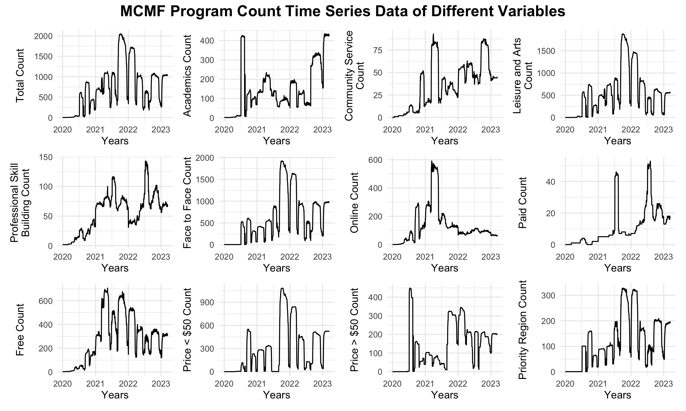
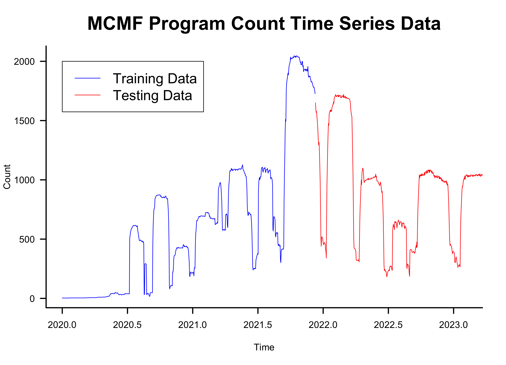
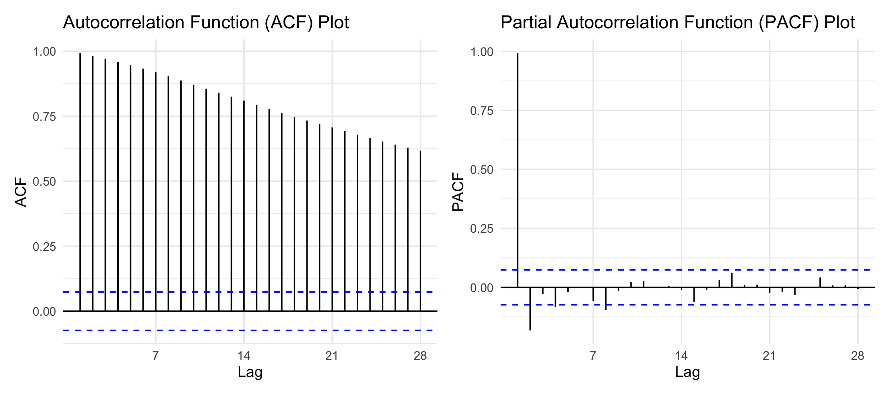
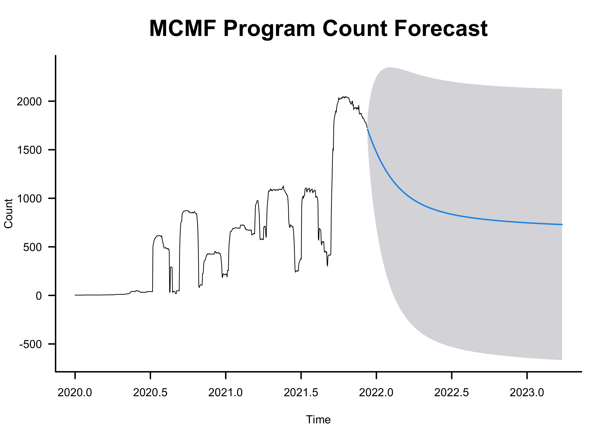
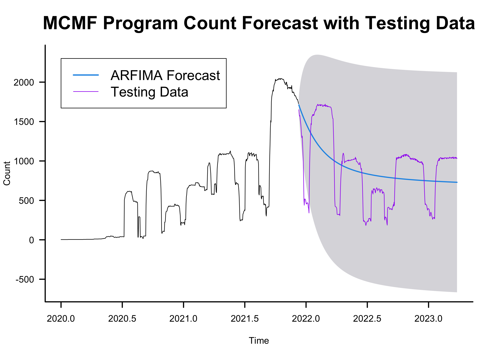
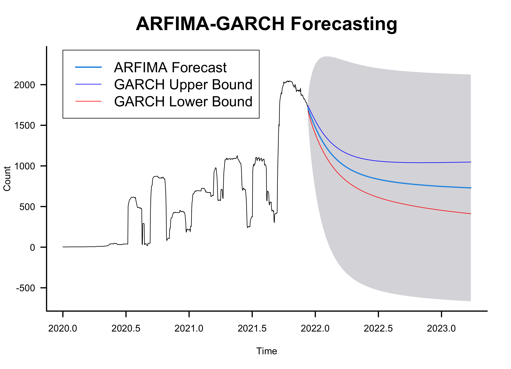
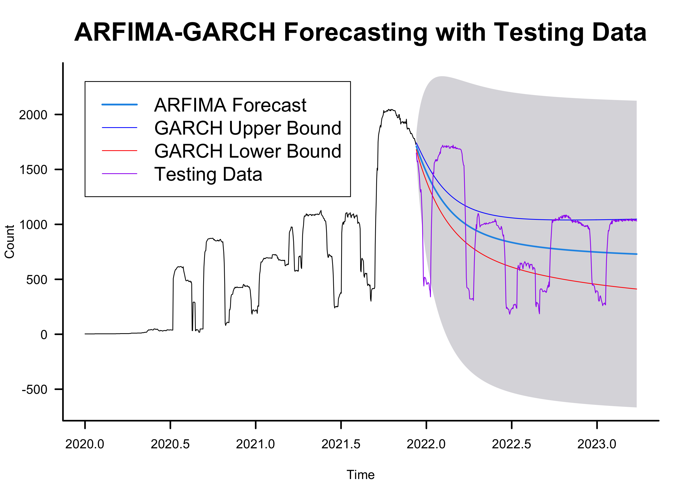
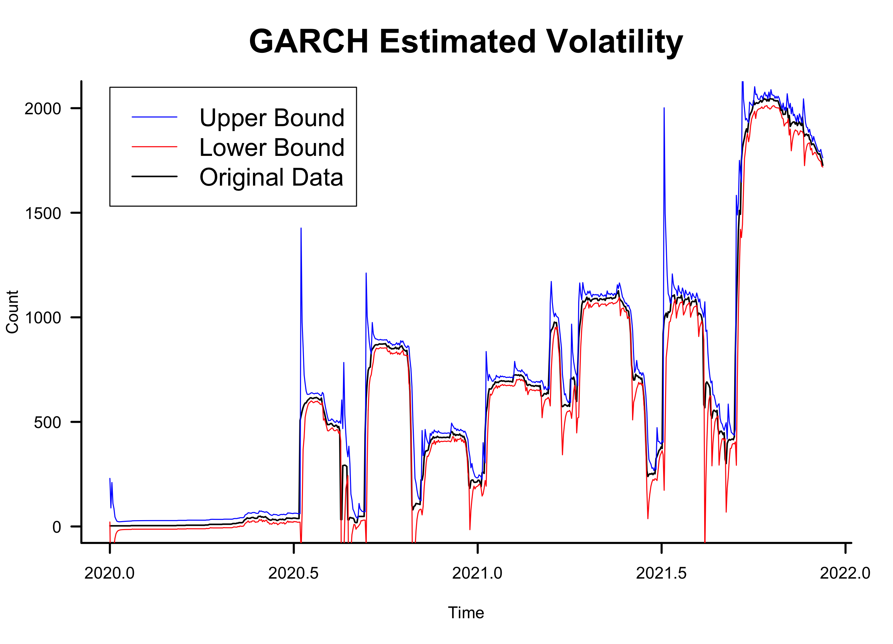

```{r, echo=FALSE, message=FALSE}
library(tidyverse)
library(formattable)
load("plots/performance.rds")
```

# Overview
With the MCMF program data, I created two predictive models: NLP machine learning category classification model and time series program count forecasting model. 

Click on the following link to learn more about the data cleaning process and EDA:

[Link to EDA](https://github.com/emmayu18/MCMF-project/blob/main/eda/EDA.md){target="_blank"}

# Text Classification
Each program in the dataset has a description and I wanted to see if I could use NLP modeling to predict the category (Academics, Community Service, Leisure and Arts, or Professional Skill Building) of a program based on its description. Although I performed the data wrangling in R, I decided to do all of the modeling in Python through a Jupyter notebook file because it was significantly faster at training the models. A successful category classification model could reduce the data input work of program planners and perhaps classify the programs more accurately. <br>

[Link to Jupyter notebook](https://github.com/emmayu18/MCMF-project/blob/main/model/text_classification.ipynb){target="_blank"}

## Models Tested
* Logistic regression
* Multinomial Naive-Bayes
* Random forest
* Support vector machine (SVM)
* K-nearest neighbors
* Stacked model of the previous 5

## Techniques
The following are techniques I implemented in my modeling to improve performance: <br>

* Text pre-processing
  * Text cleaning
  * Stop word removal
  * Stemming
  * Frequent token removal
  * TF-IDF vectorization
* Grid search via stratified k-fold cross validation
* Model stacking

The following techniques resulted in a decrease in cross validation score: <br>

* Word2Vec
* Dimensionality reduction (SVD because the tokenized data is a sparse matrix)
* Random oversampling, random undersampling, and a combination of both
* Balanced class weights for logistic regression, random forest, and SVM

## Results
I used 4 methods to test my model:<br><br>

### 1. Testing Data
I first used the testing set from the original data split. The following table contains the resulting metrics:

```{r, echo=FALSE}
result = tibble(Metric = c("Accuracy", 
                           "F1-score",
                           "Precision",
                           "Recall", 
                           "ROC AUC", 
                           "Hamming Loss"),
                Value = c(0.885, 0.733, 0.811, 0.680, 0.945, 0.115))
formattable(result, align = c("l", "c"))
```

All of the performance metrics are in the acceptable to good range, indicating that the model is sufficient at categorizing the MCMF programs through their descriptions. Recall is the lowest, most likely due to the imbalance in the data. <br><br>

### 2. Updated Data (2024)
The original data used to train the model was downloaded in April 2023. I obtained an updated dataset in August 2024 with new observations. The following table contains the performance metrics for the new dataset:

```{r, echo=FALSE}
result = tibble(Metric = c("Accuracy", 
                           "F1-score",
                           "Precision",
                           "Recall", 
                           "ROC AUC", 
                           "Hamming Loss"),
                Value = c(0.848, 0.639, 0.739, 0.595, 0.901, 0.152))
formattable(result, align = c("l", "c"))

# formattable(result, 
#             align = c("l", "c"),
#             list(Value = formatter("span",
#                                    style = function(x){
#                                      style(display = "block",
#                                            padding = "0 4px",
#                                            `border-radius` = "4px",
#                                            `background-color` = csscolor(
#                                              gradient(
#                                                as.numeric(c(c(0,1),
#                                                 unlist(result[[2]]))),
#                                                "white", "#28c752"))[-(1:2)])
#                                    })))
```

The performance is slightly worse than what we saw with the testing set but it is pretty similar. In this case, the f1-score and recall are in slightly concerning range, indicating that the model is most likely conservative in its prediction. <br><br>

### 3. Multi-Category Data
Before modeling, I removed observations that were labeled with multiple categories from the dataset. For this testing method, I ran these observations through the model to see if the predicted category was one of the multiple categories. **Out of 1086 programs, 994 were correctly classified (91.5%)**. <br><br>

### 4. Manually-Made Data
I hand wrote descriptions of imaginary afterschool programs to see if the model can correctly predict the category. The `True` column shows the category I labeled each program as and the `Predicted` column shows the category classified by the model. 

```{r, echo=FALSE}
result = tibble(True = c("Professional Skill Building",
                         "Leisure and Arts",
                         "Community Service",
                         "Academics",
                         "Professional Skill Building",
                         "Leisure and Arts",
                         "Community Service",
                         "Academics"),
                Predicted = c("Professional Skill Building",
                              "Leisure and Arts",
                              "Leisure and Arts",
                              "Academics",
                              "Professional Skill Building",
                              "Leisure and Arts",
                              "Leisure and Arts",
                              "Academics"))

formattable(result,
            align = c("l", "l"),
            list(True = formatter("span",
                                  style = ~ style(color = ifelse(
                                    True != Predicted, "#cf0000", "#333333"
                                  ))),
                 Predicted = formatter("span",
                                       style = ~ style(color = ifelse(
                                         True != Predicted, "#cf0000", "#333333"
                                       )))))
```

It looks like the model is good at predicting the categories on completely new data but has trouble classifying Community Service opportunities. This could be because of the imbalance in the training dataset. Community Service was the smallest category in the training data while Leisure and Arts was the largest.

## Next Steps
In order to improve performance, I could implement text augmentation (synonym replacement, random insertion/deletion, text paraphrasing, etc.). I could also experiment with a hybrid of random over/undersampling and class weighting. I have tried both techniques separately but saw a decrease in performance (most likely due to overfitting), but I think an appropriate combination of those methods could possibly improve performance. Increasing the number of TF-IDF features have shown to increase performance and if I had the computing power, that is another strategy I would experiment with. However, I would have to be careful not to overfit the training data. <br><br>

# Time Series Analysis
In the original data, each program had a start date and end date, which allowed a time series analysis on the program count. I wanted to create a forecasting model to predict MCMF program count. After looking at the time series data and seeing moderate volatility, I also trained a volatility model. <br>

[Link to R script](https://github.com/emmayu18/MCMF-project/blob/main/model/growth_forecasting.R){target="_blank"}

## Data
The following grid shows time series plots for each variable in the dataset. Since most of the variables follow a similar pattern as the total count time series, I decided to focus my analysis on the overall data.

{width=65%} 

The next figure shows the time series plot of the MCMF program count. I used a 60-40 ratio to split the training and testing sets.

{width=65%}

The data consisted of daily program count from 1/1/2020 to 3/15/2023. The training/testing cutoff was at 12/2/2021. The plot shows a complex time series with significant dips that seem to display seasonality. The dips are found approximately every 2-5 months, during student holiday seasons (spring break, start of summer break, end of summer break, winter holidays). There is also a general trend of count growth from 2020 to the later quarter of 2021. The program count peaks at slightly over 2000 programs and then displays a decreasing trend. The data also seems to have a moderate amount of volatility even without the dips.

## Models Tested
The following models were tested for program count forecasting: <br>

* Autoregressive Integrated Moving Average (ARIMA) model
* Seasonal Autoregressive Integrated Moving Average (SARIMA) model
* Autoregressive Fractionally Integrated Moving Average (ARFIMA) model 

The following model was tested for volatility modeling/forecasting: <br>

* Generalized Autoregressive Conditional Heteroscedastic (GARCH) model

<br> I ultimately decided to use ARFIMA to model the time series data because although the data passed the Augmented Dickey-Fuller test and was proven to be stationary, the ACF plot did not display a significant cutoff. This could be indicating that the data is long-range dependent and ARFIMA is the best-suited model for this type.

{width=80%}

## Results
### Performance Metric
The following table shows the resulting performance metric values from comparing the forecasted data to the test data:

```{r, echo=FALSE}
load("plots/performance.rds")
formattable(perf_met,
            align = c('l', 'c'))
```

The performance metrics indicate that the model is not completely good at forecasting program count. However, this is expected from running a complex time series data through a model that is used to simpler data. <br><br>

### ARFIMA Forecast
The following plots show the forecasted data from the ARFIMA model compared to the testing data:

{width=45%} {width=45%}

Although the performance metrics were not good, we can see from the plots that the forecast follows the general decreasing trend of the testing data. <br><br>

### ARFIMA-GARCH Forecast
The following plots show the ARFIMA forecast along with the volatility forecast made by the GARCH model:

{width=45%} {width=45%}
<br><br>

### GARCH Variance Bounds
I also plotted the conditional variance bounds against the training data:

{width=65%}

## Next Steps
The time series data for MCMF programs was very complex, with extreme fluctuations that isn't captured by simple seasonal differencing, contributing to the inadequate performance. Despite the limitations imposed by the nature of the data, the ARFIMA model was able to accurate forecast the general trend of the program count. In order to create a model that is able to capture the complexity of this data, I could try training a deep learning model such as LSTM. I could also take a completely opposite approach and try a simpler forecasting method such as exponential smoothing.<br><br>

